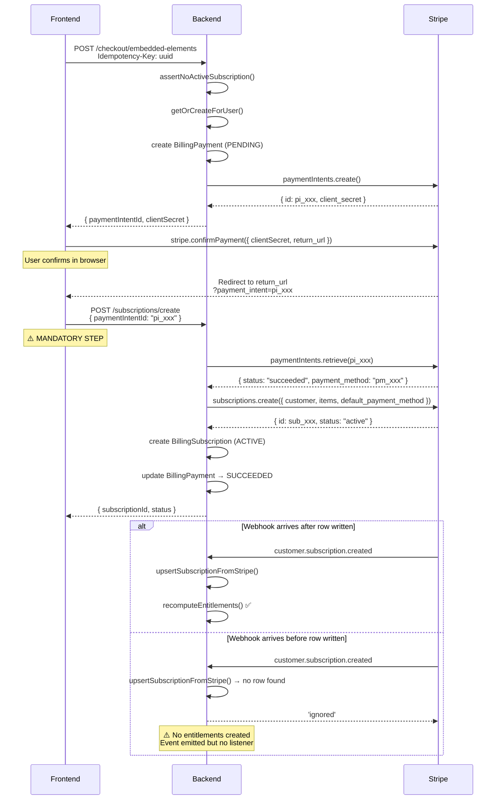
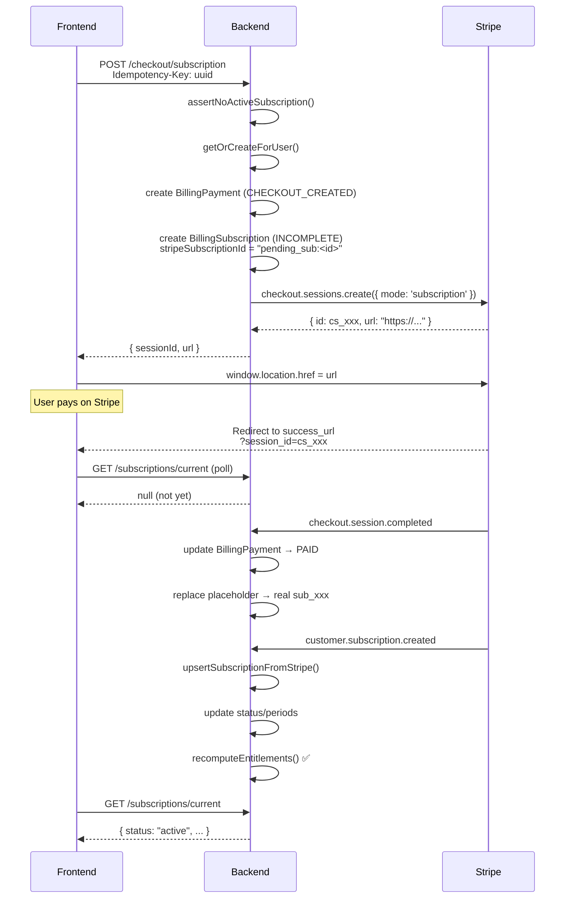
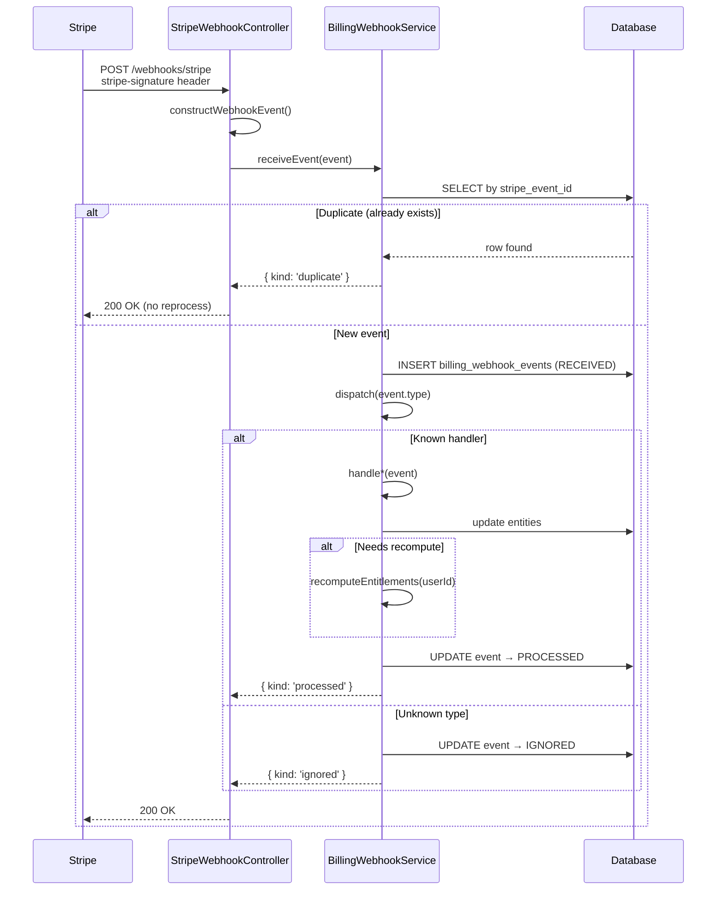
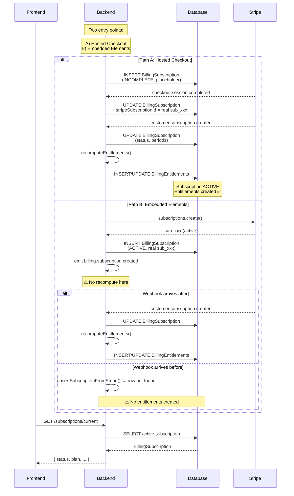

# Billing & Subscription Architecture

**Source of Truth** — Everything in this document is derived from tracing actual backend code paths in `src/billing/` and `src/plans-subscriptions/`. If code contradicts this document, the code wins (file a bug).

---

## Overview

The billing system implements two separate subscription checkout workflows, both backed by Stripe:

| Aspect | Hosted Checkout (Canonical) | Embedded Elements (Secondary) |
|--------|----------------------------|-------------------------------|
| **Stripe surface** | Checkout Session (redirect) | PaymentIntent + Elements |
| **Subscription shell** | Pre-created before payment (`INCOMPLETE`) | Created after payment (`ACTIVE`) |
| **Entitlement trigger** | Always via webhook | Race-dependent via webhook |
| **Frontend API calls after redirect** | None | **Must call** `POST /api/billing/subscriptions/create` |
| **Success URL parameter** | `?session_id=cs_xxx` | `?payment_intent=pi_xxx` |

**Key entities:** `BillingCustomer`, `BillingPayment`, `BillingSubscription`, `BillingEntitlement`, `BillingTransaction`, `BillingInvoice`

**State machine:** Checkout creation → Payment → Webhook processing → Subscription activation → Entitlement generation

---

## Subscription Checkout Flow

There are exactly **two code paths** that create `BillingSubscription` rows:

### Path A: Hosted Checkout (Webhook-driven, canonical)

```
POST /api/billing/checkout/subscription
  → assertNoActiveSubscription()
  → BillingPayment (CHECKOUT_CREATED)
  → BillingSubscription (INCOMPLETE, stripe_subscription_id = "pending_sub:<id>")
  → stripe.checkout.sessions.create (mode: subscription)
  → Updates payment.stripeCheckoutSessionId, subscription.stripeCheckoutSessionId
  → User redirects to Stripe

[Webhook] checkout.session.completed  (arrives after user pays)
  → handleCheckoutSessionCompleted()
  → Updates BillingPayment: stripePaymentIntentId, status → PAID
  → Replaces subscription placeholder with real sub_xxx
  → Updates BillingSubscription: stripeSubscriptionId = real sub_xxx
  → Emits billing.payment.succeeded

[Webhook] customer.subscription.created  (may arrive before or after)
  → handleSubscriptionCreated()
  → upsertSubscriptionFromStripe()
  → Matches by stripeSubscriptionId (real sub_xxx) or by placeholder
  → Updates status, currentPeriodStart, currentPeriodEnd, trialEnd, etc.
  → Emits billing.subscription.created
  → Calls recomputeEntitlements(userId)  ← ENTITLEMENTS CREATED HERE
```

### Path B: Embedded Elements (Frontend-driven, secondary)

```
POST /api/billing/checkout/embedded-elements
  → assertNoActiveSubscription()
  → BillingPayment (PENDING)
  → stripe.paymentIntents.create
  → Updates payment.stripePaymentIntentId

Frontend: stripe.confirmPayment(clientSecret)
  → PaymentIntent confirmed on browser
  → User redirected to success URL with ?payment_intent=pi_xxx

POST /api/billing/subscriptions/create  { paymentIntentId: "pi_xxx" }
  → createSubscriptionFromPayment()
  → stripe.paymentIntents.retrieve(pi_xxx) → verifies status === "succeeded"
  → Extracts payment_method from PaymentIntent
  → stripe.subscriptions.create({ customer, items, default_payment_method })
  → Creates BillingSubscription (ACTIVE, stripeSubscriptionId = sub_xxx)
  → Updates BillingPayment: status → SUCCEEDED
  → Emits billing.subscription.created
  → DOES NOT call recomputeEntitlements()

[Webhook — timing-dependent] customer.subscription.created
  → handleSubscriptionCreated()
  → upsertSubscriptionFromStripe()
  → Finds row by stripeSubscriptionId (already set)
  → Updates status, periods, etc.
  → Calls recomputeEntitlements(userId)  ← ENTITLEMENTS ONLY if webhook arrives after row exists
```

---

## Embedded Elements Flow

### API Calls (in order)

| Step | Endpoint | Request | Response |
|------|----------|---------|----------|
| 1 | `POST /api/billing/checkout/embedded-elements` | `{ priceId, successUrl, cancelUrl }` + `Idempotency-Key` | `{ paymentIntentId, clientSecret }` |
| 2 | (browser) `stripe.confirmPayment()` | `{ clientSecret, return_url }` | Redirects browser |
| 3 | `POST /api/billing/subscriptions/create` | `{ paymentIntentId }` + `Idempotency-Key` | `{ subscriptionId, status }` |
| 4 (optional) | `GET /api/subscriptions/current` | — | `{ subscription data }` |

### Stripe Interactions

1. Backend creates `paymentIntents.create({ amount, currency, setup_future_usage: 'off_session', customer })`
2. Frontend calls `stripe.confirmPayment(clientSecret)` — confirms on browser via Elements
3. Backend calls `paymentIntents.retrieve(pi_xxx)` to verify `status === 'succeeded'`
4. Backend calls `subscriptions.create({ customer, items: [{ price }], default_payment_method })`

### URL Redirects

**⚠️ CRITICAL:** The success URL parameter for this flow is `payment_intent`, **NOT** `session_id`.

After `stripe.confirmPayment()` succeeds, Stripe redirects the browser to:
```
{return_url}?payment_intent=pi_xxx&payment_intent_client_secret=pi_xxx_secret_xxx&redirect_status=succeeded
```

There is **no** `session_id` parameter in this URL.

### Required Frontend Actions

1. Call `POST /api/billing/checkout/embedded-elements` → get `clientSecret`
2. Mount `<Elements>` + `<PaymentElement>` with `clientSecret`
3. Call `stripe.confirmPayment({ clientSecret, return_url })`
4. **On success page:** read `payment_intent` from URL search params
5. **Mandatory:** Call `POST /api/billing/subscriptions/create` with `{ paymentIntentId }`
6. Optional: Poll `GET /api/subscriptions/current` until status is `active`

### Required Backend Actions

1. Verify no active subscription exists (`assertNoActiveSubscription()`)
2. Get or create Stripe customer (`getOrCreateForUser()`)
3. Create `BillingPayment` record (status `PENDING`)
4. Create Stripe `PaymentIntent` with `setup_future_usage: 'off_session'`
5. In `createSubscriptionFromPayment()`: verify PaymentIntent status from Stripe
6. Create Stripe subscription with confirmed `payment_method`
7. Create local `BillingSubscription` (status `ACTIVE`)
8. Update `BillingPayment` status to `SUCCEEDED`

---

## Hosted Checkout Flow

### API Calls

| Step | Endpoint | Request | Response |
|------|----------|---------|----------|
| 1 | `POST /api/billing/checkout/subscription` | `{ priceId, successUrl, cancelUrl }` + `Idempotency-Key` | `{ sessionId, url }` |

That's it. No additional frontend API calls are needed after the redirect.

### Stripe Redirects

The response contains a `url` pointing to Stripe Checkout. The user is redirected via `window.location.href = url`. After payment, Stripe redirects to:
```
{successUrl}?session_id=cs_xxx
```

### Webhook Behavior

Two webhooks fire asynchronously:

| Webhook | What it does |
|---------|-------------|
| `checkout.session.completed` | Updates `BillingPayment` to `PAID`, replaces placeholder subscription ID with real `sub_xxx` |
| `customer.subscription.created` | Updates `BillingSubscription` status/periods, creates entitlements |

### Success Flow

1. User lands on `{successUrl}?session_id=cs_xxx`
2. Page reads `session_id` from URL
3. No additional API call required — webhooks handle everything
4. Optionally poll `GET /api/subscriptions/current` until subscription appears

---

## Webhook Processing

### Entry Point

`POST /api/billing/webhooks/stripe` → `StripeWebhookController.handleStripeWebhook()` → `BillingWebhookService.receiveEvent()`

### Processing Pipeline

1. Signature verification via `BillingStripeService.constructWebhookEvent()`
2. Event deduplication: check `billing_webhook_events` by `stripe_event_id` (unique index)
3. Persist event row (status `RECEIVED`)
4. Dispatch to typed handler via `dispatch()`
5. Handler returns `'processed'` or `'ignored'`
6. Row status updated to `PROCESSED` or `IGNORED`
7. On throw: row marked `FAILED`, error propagates to controller → 5xx (Stripe retries)

### Event Handlers

#### `checkout.session.completed`

| Aspect | Detail |
|--------|--------|
| **Purpose** | Complete a checkout session — record successful payment and activate subscription |
| **DB changes** | `BillingPayment`: status → `PAID`, `stripePaymentIntentId` set. `BillingSubscription`: placeholder `pending_sub:` replaced with real `sub_xxx` |
| **Side effects** | Emits `billing.payment.succeeded`. Does **not** call `recomputeEntitlements()` |

#### `checkout.session.expired`

| Aspect | Detail |
|--------|--------|
| **Purpose** | Handle abandoned checkouts |
| **DB changes** | `BillingPayment`: status → `CANCELED`. `BillingSubscription`: status → `INCOMPLETE_EXPIRED` |
| **Side effects** | None |

#### `payment_intent.succeeded`

| Aspect | Detail |
|--------|--------|
| **Purpose** | Record that a payment succeeded |
| **DB changes** | `BillingPayment`: status → `SUCCEEDED`. Creates `BillingTransaction(charge)` |
| **Side effects** | **Calls `recomputeEntitlements()`** |

#### `payment_intent.payment_failed`

| Aspect | Detail |
|--------|--------|
| **Purpose** | Record a failed payment attempt |
| **DB changes** | `BillingPayment`: status → `FAILED` |
| **Side effects** | None |

#### `charge.succeeded`

| Aspect | Detail |
|--------|--------|
| **Purpose** | Confirm charge succeeded (supplementary to `payment_intent.succeeded`) |
| **DB changes** | Updates `BillingPayment` status |
| **Side effects** | None |

#### `charge.refunded`

| Aspect | Detail |
|--------|--------|
| **Purpose** | Record a refund |
| **DB changes** | Creates `BillingTransaction(refund)`. Updates `BillingPayment.amountRefunded` + status |
| **Side effects** | None |

#### `customer.created` / `customer.updated`

| Aspect | Detail |
|--------|--------|
| **Purpose** | Sync Stripe customer metadata to local DB |
| **DB changes** | Updates `BillingCustomer` name, email, metadata |
| **Side effects** | None (informational — local customer already created by `getOrCreateForUser()`) |

#### `customer.subscription.created`

| Aspect | Detail |
|--------|--------|
| **Purpose** | Track a new subscription lifecycle |
| **DB changes** | `upsertSubscriptionFromStripe()` — finds local row by `stripeSubscriptionId` or placeholder, updates status, `currentPeriodStart`, `currentPeriodEnd`, `trialEnd`, etc. |
| **Side effects** | **Calls `recomputeEntitlements()`. Emits `billing.subscription.created`** |

#### `customer.subscription.updated`

| Aspect | Detail |
|--------|--------|
| **Purpose** | Track subscription changes (upgrades, downgrades, status changes) |
| **DB changes** | Same as `created` — `upsertSubscriptionFromStripe()` updates the row |
| **Side effects** | **Calls `recomputeEntitlements()`** |

#### `customer.subscription.deleted`

| Aspect | Detail |
|--------|--------|
| **Purpose** | Handle subscription cancellation |
| **DB changes** | `BillingSubscription`: status → `CANCELED` |
| **Side effects** | **Calls `recomputeEntitlements()`** |

#### `invoice.*` lifecycle

| Aspect | Detail |
|--------|--------|
| **Purpose** | Track invoice lifecycle (payment succeeded, finalized, etc.) |
| **DB changes** | Creates/updates `BillingInvoice` |
| **Side effects** | None (except `invoice.payment_failed`) |

#### `invoice.payment_failed`

| Aspect | Detail |
|--------|--------|
| **Purpose** | Handle failed invoice payment (dunning) |
| **DB changes** | Creates/updates `BillingInvoice`. Marks `BillingPayment` → `FAILED` |
| **Side effects** | **Calls `recomputeEntitlements()`** |

### Entitlement Recompute Call Sites

All five calls to `recomputeEntitlements()` are in `billing-webhook.service.ts`:

| Line | Handler |
|------|---------|
| 638 | `handlePaymentIntentSucceeded()` |
| 851 | `handleSubscriptionCreated()` |
| 868 | `handleSubscriptionUpdated()` |
| 896 | `handleSubscriptionDeleted()` |
| 1039 | `handleInvoicePaymentFailed()` |

**No frontend-facing endpoint calls `recomputeEntitlements()`.**

---

## Subscription Creation Rules

### Who Creates Subscriptions

| Component | Method | Flow | Status |
|-----------|--------|------|--------|
| `BillingCheckoutService` | `createSubscriptionCheckout()` | Hosted Checkout | Creates shell (`INCOMPLETE`) with placeholder `pending_sub:` |
| `BillingCheckoutService` | `createSubscriptionFromPayment()` | Embedded Elements | Creates real (`ACTIVE`) after payment |
| `BillingWebhookService` | `upsertSubscriptionFromStripe()` | Both (webhook) | Updates existing — never creates from scratch |

### When Subscriptions Are Created

| Flow | Timing |
|------|--------|
| Hosted Checkout | **Before** payment — a shell row with `INCOMPLETE` status and placeholder `stripe_subscription_id` |
| Embedded Elements | **After** payment — a full row with `ACTIVE` status and real `stripe_subscription_id` |

### Allowed Creation Paths

1. **Hosted Checkout → webhooks** (canonical): Shell pre-created by `createSubscriptionCheckout()`, finalized by `checkout.session.completed` + `customer.subscription.created` webhooks
2. **Embedded Elements → `createSubscriptionFromPayment()`** (secondary): No shell, created entirely by the frontend-driven endpoint after `confirmPayment()`

### Forbidden Creation Paths

1. **External subscription creation** (Stripe dashboard, admin API): The `customer.subscription.created` webhook handler can't find a local row or metadata match → returns `'ignored'`. The system only manages subscriptions it created.
2. **Concurrent duplicate subscriptions**: `assertNoActiveSubscription()` prevents a second checkout while an active subscription exists. Placeholder subscriptions (`pending_sub:`) are excluded from this check, allowing retries.

---

## Entitlement Generation

### Trigger Points

Entitlements are recomputed **only** by webhook handlers (five call sites). No frontend-facing endpoint triggers recomputation.

### Recalculation Logic

```
recomputeForUser(userId):
  1. Build expected entitlement tuples from:
     - BillingSubscription rows with status in [ACTIVE, TRIALING, PAST_DUE]
     - BillingPayment rows with status SUCCEEDED linked to a one_time price
  2. Reactivate historical rows or insert new rows for expected tuples
  3. Deactivate active rows not in expected set (active=false, endsAt=now)
  4. Manual grants (sourceType='manual') are never deactivated
```

### Database Updates

| Action | Rows affected |
|--------|--------------|
| Insert new entitlement | `BillingEntitlement` (active=true) |
| Reactivate historical | `BillingEntitlement` (active=true, endsAt=null) |
| Deactivate expired | `BillingEntitlement` (active=false, endsAt=now) |

### Source Resolution

```
BillingSubscription.planId → BillingPlan.features[] → one entitlement per featureKey
BillingPayment.priceId → BillingPrice.planId → BillingPlan.features[] → one entitlement per featureKey
```

### Known Gap

**Path B (Embedded Elements) has no entitlement recompute.** `createSubscriptionFromPayment()` at `billing-checkout.service.ts:566` creates the subscription but never calls `recomputeEntitlements()`. It emits `billing.subscription.created`, but **no event listeners are registered** in the billing module to consume this event.

Entitlements for Path B depend entirely on the `customer.subscription.created` webhook arriving **after** `createSubscriptionFromPayment()` writes the local row. If the webhook arrives first, it can't find the row → returns `'ignored'` → no entitlements are ever created.

---

## Success Page Contract

### URL Parameters Per Flow

**⚠️ CRITICAL: Each flow returns different URL parameters. The frontend MUST read the correct one.**

| Flow | URL Parameters After Redirect | Frontend Reads |
|------|------------------------------|----------------|
| Hosted One-Time (`/checkout/one-time`) | `?session_id=cs_xxx` | `searchParams.get("session_id")` |
| Hosted Subscription (`/checkout/subscription`) | `?session_id=cs_xxx` | `searchParams.get("session_id")` |
| Hosted embedded (`ui_mode=embedded_page`) | `?session_id=cs_xxx` | `searchParams.get("session_id")` |
| **Embedded Elements subscription** (`/checkout/embedded-elements`) | `?payment_intent=pi_xxx&payment_intent_client_secret=...&redirect_status=succeeded` | **`searchParams.get("payment_intent")`** |
| Embedded Elements one-time (`/checkout/embedded-elements-one-time`) | `?session_id=cs_xxx&payment_intent=pi_xxx&...` | Either `session_id` or `payment_intent` |

**⚠️ KNOWN BUG:** If the frontend success page unconditionally calls `searchParams.get("session_id")`, the Embedded Elements subscription flow will always return `null` because Stripe's `confirmPayment()` redirect adds `payment_intent=pi_xxx` — never `session_id`.

### Expected API Calls After Redirect

| Flow | API Call | Purpose |
|------|----------|---------|
| Hosted Checkout | None (optional poll) | Webhooks handle everything |
| Embedded Elements | **`POST /api/billing/subscriptions/create`** (mandatory) | Creates Stripe subscription + local `BillingSubscription` |
| Embedded Elements one-time | None (optional poll) | Checkout Session + webhooks handle it |

### Polling Behavior

- Optional for all flows
- Poll `GET /api/subscriptions/current`
- Expected response when subscription is active: `{ id, status: 'active', ... }`
- Expected response before subscription exists: `null`

### Error Handling

| Scenario | Behavior |
|----------|----------|
| Polling timeout (30s) | Show "Subscription pending" with retry button |
| `POST /api/billing/subscriptions/create` returns 4xx | Show error with retry button |
| `POST /api/billing/subscriptions/create` returns 409 (Idempotency-Key reused) | Treat as success — subscription already exists |
| Webhook delayed (>60s) | Show "Processing payment" with support contact |
| Payment failed (redirect_status= `failed`) | Show failure UI, offer retry checkout |

---

## Idempotency Strategy

### Duplicate Request Handling (Frontend API Calls)

All checkout endpoints and `POST /api/billing/subscriptions/create` require the `Idempotency-Key` header.

| Aspect | Detail |
|--------|--------|
| **Header** | `Idempotency-Key: <client-generated UUID>` |
| **Body hash** | SHA-256 of canonicalized request body |
| **DB storage** | `billing_idempotency_keys` table with unique index on `key` |
| **First request** | Row created with status `IN_PROGRESS`, operation runs |
| **Same key + same body** | Returns cached response (status `COMPLETED`) |
| **Same key + different body** | **409 Conflict** |
| **Same key after failure** | Allowed to retry (row becomes `IN_PROGRESS` again) |
| **TTL** | 24 hours — expired keys treated as fresh if failed, cached if completed |

**Scope names** (prevent key reuse across different operations):

| Scope | Endpoint |
|-------|----------|
| `checkout.one_time` | `POST /checkout/one-time` |
| `checkout.subscription` | `POST /checkout/subscription` |
| `subscription.payment_intent` | `POST /checkout/embedded-elements` |
| `subscription.create_from_payment` | `POST /subscriptions/create` |

### Duplicate Webhook Handling

| Aspect | Detail |
|--------|--------|
| **Mechanism** | Unique index on `billing_webhook_events.stripe_event_id` |
| **Race safety** | `INSERT` with try/catch on `QueryFailedError` — if duplicate, returns `{ kind: 'duplicate' }` |
| **Effect** | Duplicate webhooks are silently ignored — no reprocessing |
| **Stripe retries** | If handler throws 5xx, row marked `FAILED`, Stripe retries with exponential backoff |

### Recovery Behavior

| Scenario | Outcome |
|----------|---------|
| Idempotency key expired + failed | Fresh attempt allowed |
| Idempotency key expired + completed | Cached response returned (key retained) |
| Server crash mid-operation | Idempotency row stays `IN_PROGRESS` — client retries after timeout |
| Webhook delivery timeout | Stripe retries → deduplication check → reprocessed if not yet `PROCESSED` |

---

## Race Condition Analysis

| # | Race | Participants | Severity | Protected? | Current Protection |
|---|---|---|---|---|---|
| 1 | Two parallel checkout calls from same user | Both call `getOrCreateForUser()` + Stripe calls | Low | **Yes** | `pessimistic_write` lock on User row in `getOrCreateForUser()`. `assertNoActiveSubscription()` after lock. |
| 2 | Webhook arrives before local subscription row exists | `customer.subscription.created` webhook vs `createSubscriptionFromPayment()` | **Medium** | **Partial** | Webhook can't find row → `'ignored'`. No entitlements created. Retry depends on next subscription update webhook. |
| 3 | `createSubscriptionFromPayment()` races with `payment_intent.succeeded` webhook | Webhook updates `BillingPayment` before `createSubscriptionFromPayment()` reads it | Low | **Yes** (by design) | `createSubscriptionFromPayment()` reads status from Stripe API, not local DB. Webhook updates are additive. |
| 4 | `customer.created` webhook arrives before `getOrCreateForUser()` returns | Webhook vs customer creation | Low | **Yes** (by design) | Webhook can't find local row → `'ignored'`. Local row created on next billing endpoint call. |
| 5 | Duplicate webhook delivery | Two identical webhook events | None | **Yes** | Unique index on `billing_webhook_events.stripe_event_id` + race-safe INSERT |
| 6 | Concurrent idempotency keys (same key, two requests) | Two requests with same key | None | **Yes** | Unique index on `billing_idempotency_keys.key` + race-safe INSERT |

### Unprotected Race (Detail)

**Race #2 — Entitlement gap in Embedded Elements flow:**

1. Frontend calls `POST /api/billing/subscriptions/create`
2. Backend calls `stripe.subscriptions.create()` → creates subscription on Stripe
3. Stripe fires `customer.subscription.created` webhook
4. Webhook arrives before `createSubscriptionFromPayment()` writes the local `BillingSubscription` row
5. `upsertSubscriptionFromStripe()` can't find a local row → returns `null` → handler returns `'ignored'`
6. `createSubscriptionFromPayment()` completes, writes the row, emits `billing.subscription.created` — but **no listener subscribes to this event**
7. Result: User has an active subscription on Stripe and in the local DB, but **no entitlements are ever created**

This only affects Path B (Embedded Elements). Path A (Hosted Checkout) is not vulnerable because the subscription shell is pre-created before the user is redirected to Stripe.

---

## Frontend Contract

### Hosted Checkout (Canonical)

```
1. POST /api/billing/checkout/subscription
   Headers: Idempotency-Key: <uuid>
   Body: { priceId, successUrl, cancelUrl, uiMode: "hosted_page" }
   Response: { sessionId: "cs_xxx", url: "https://checkout.stripe.com/..." }

2. window.location.href = response.url

3. [User pays on Stripe, redirected back]

4. Read searchParams from URL:
   - searchParams.get("session_id") → "cs_xxx"

5. Optional: Poll GET /api/subscriptions/current until response is non-null
```

### Embedded Elements Subscription (Secondary)

```
1. POST /api/billing/checkout/embedded-elements
   Headers: Idempotency-Key: <uuid>
   Body: { priceId, successUrl, cancelUrl }
   Response: { paymentIntentId: "pi_xxx", clientSecret: "pi_xxx_secret_xxx" }

2. Mount <Elements stripe={stripePromise} options={{ clientSecret }}>
   Inside: <PaymentElement />

3. const { error } = await stripe.confirmPayment({
   elements,
   confirmParams: { return_url: successUrl }
   })

4. [Stripe redirects browser on success]

5. Read searchParams from URL:
   - searchParams.get("payment_intent") → "pi_xxx"  ← NOT session_id
   - searchParams.get("redirect_status") → "succeeded"

6. ⚠️ MANDATORY — call this on the success page:
   POST /api/billing/subscriptions/create
   Headers: Idempotency-Key: <new-uuid>
   Body: { paymentIntentId: "pi_xxx" }
   Response: { subscriptionId: "sub_xxx", status: "active" }

7. Optional: Poll GET /api/subscriptions/current
```

### ⚠️ Known Bug: `session_id` vs `payment_intent`

The frontend success page must **distinguish which flow was used** and read the correct URL parameter:

```
function getPaymentIdentifier(searchParams, flow) {
  if (flow === 'hosted') return searchParams.get('session_id')
  if (flow === 'elements_subscription') return searchParams.get('payment_intent')
  if (flow === 'elements_one_time') return searchParams.get('session_id')
}
```

If the frontend unconditionally reads `searchParams.get("session_id")`, the Embedded Elements subscription flow will always receive `null` because `confirmPayment()` returns `?payment_intent=pi_xxx` — never `?session_id=...`.

---

## Backend Contract

### Hosted Checkout

| Responsibility | Component |
|----------------|-----------|
| Create Stripe Checkout Session (`mode: subscription`) | `BillingCheckoutService.createSubscriptionCheckout()` |
| Pre-create `BillingPayment` (CHECKOUT_CREATED) | Same |
| Pre-create `BillingSubscription` shell (INCOMPLETE, placeholder) | Same |
| Handle `checkout.session.completed` webhook | `BillingWebhookService.handleCheckoutSessionCompleted()` |
| Handle `customer.subscription.created` webhook | `BillingWebhookService.handleSubscriptionCreated()` |
| Replace placeholder with real subscription ID | Same |
| Recompute entitlements on webhook events | `BillingEntitlementsService.recomputeForUser()` |

### Embedded Elements

| Responsibility | Component |
|----------------|-----------|
| Create Stripe PaymentIntent | `BillingCheckoutService.createSubscriptionPaymentIntent()` |
| Create `BillingPayment` (PENDING) | Same |
| Verify PaymentIntent status from Stripe | `BillingCheckoutService.createSubscriptionFromPayment()` |
| Create Stripe subscription | Same |
| Create local `BillingSubscription` (ACTIVE) | Same |
| Update `BillingPayment` (SUCCEEDED) | Same |

### Universal

| Responsibility | Component |
|----------------|-----------|
| Get or create Stripe customer (pessimistic lock) | `BillingCustomerService.getOrCreateForUser()` |
| Enforce idempotency on all checkout/subscription endpoints | `BillingIdempotencyService` |
| Deduplicate webhook events | `BillingWebhookService.receiveEvent()` |
| Manage entitlement lifecycle | `BillingEntitlementsService.recomputeForUser()` |
| Record payment transactions | `BillingWebhookService` handlers |
| Stripe Customer Portal session creation | `BillingPortalService` |

---

## Sequence Diagrams

### 1. Embedded Elements Flow



### 2. Hosted Checkout Flow



### 3. Webhook Flow



### 4. Subscription Activation Flow



---

## Summary: Canonical vs Secondary

| Dimension | Hosted Checkout (Canonical) | Embedded Elements (Secondary) |
|-----------|----------------------------|-------------------------------|
| Design pattern | Stripe Checkout Session | PaymentIntent + Elements |
| Subscription shell | Pre-created (`INCOMPLETE`) | Created after payment (`ACTIVE`) |
| Placeholder mechanism | `pending_sub:` prefix | None |
| `appendSessionId()` | Used | Not used (no Checkout Session) |
| Webhook dependency | Complete lifecycle | Supplementary |
| Frontend API calls after redirect | None | **Required** (`POST /subscriptions/create`) |
| Entitlement generation | Always via webhook | Race-dependent (gap exists) |
| `uiMode` default | `hosted_page` | N/A |
| Retry safety | Placeholder excluded from `assertNoActiveSubscription()` | No shell — standard check |

The system was built around the **Hosted Checkout** as the primary workflow. The Embedded Elements flow is fully functional *if* the frontend calls the mandatory `POST /api/billing/subscriptions/create` step, with the caveat that entitlement generation has a timing dependency on the webhook.
