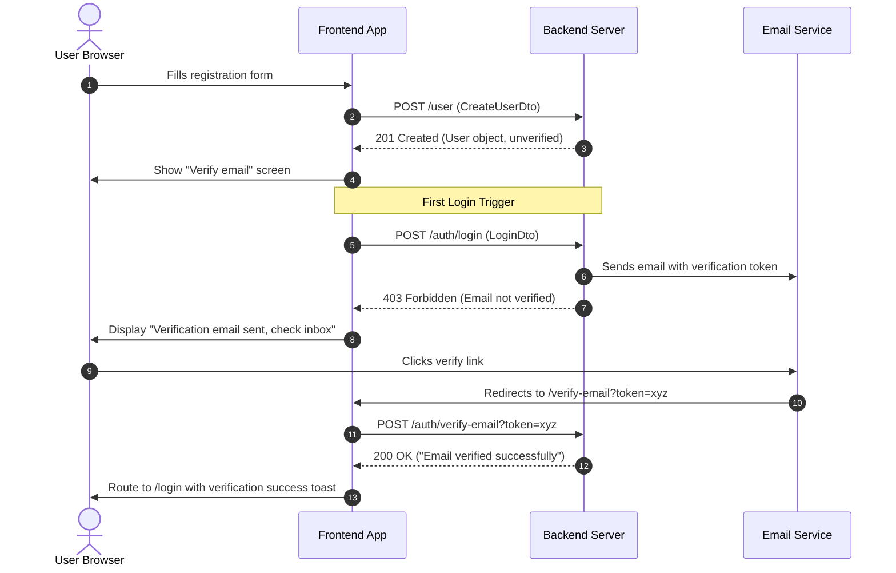
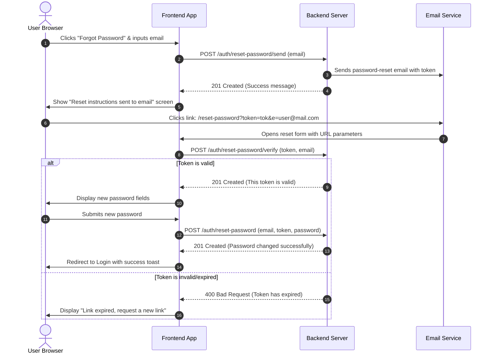

# Authentication Module Frontend Integration Plan

This document serves as a comprehensive integration guide for the frontend developer connecting to the NestJS Backend Authentication APIs. 

---

## 🔑 Core Authentication Design

The backend implements a **cookie-based JWT authentication** system. The authentication token must be sent via a cookie with every state-changing and protected request.

### Key Authentication Configuration
- **Cookie Name**: Defaults to `sanad_auth_token` (configurable via `AUTH_TOKEN` environment variable on the backend).
- **CORS Configuration**: The backend requires `credentials: true`.
- **Allowed Headers**: `Content-Type`, `Authorization`, `Cookie`.

> [!IMPORTANT]
> **Important Client-Side Cookie Handling:**
> 1. **Credentials-based Login (`POST /auth/login`)**: Returns the `access_token` inside the JSON response body. Because this endpoint does not set the cookie automatically, the frontend **must manually write** the cookie named `sanad_auth_token` using JavaScript (e.g., `document.cookie` or a library like `js-cookie`) with the value of the `access_token`.
> 2. **Google OAuth Login (`GET /auth/google`)**: The backend handles the callback redirect, writes the `sanad_auth_token` cookie as an `httpOnly`, `secure` (in production), and `sameSite: strict` cookie, and then redirects the user to the frontend (`${FRONTEND_URL}?refresh=1`).
> 3. **API Client Setup**: Ensure your API client (e.g., Axios or Fetch) is configured to send cookies with every request (`withCredentials: true` or `credentials: 'include'`).

---

## 📊 Endpoint Summary Table

| HTTP Method | Route | Auth Required | Throttling Limits | Description |
| :--- | :--- | :---: | :--- | :--- |
| **POST** | `/user` | ❌ No | None | Register a new user |
| **POST** | `/auth/login` | ❌ No | 5 requests / 15 mins | Authenticate using email & password |
| **POST** | `/auth/verify-email` | ❌ No | 5 requests / 15 mins | Verify email using a token query param |
| **POST** | `/user/verify-email` | ❌ No | None | Verify email using a JSON body token |
| **POST** | `/auth/reset-password/send` | ❌ No | 3 requests / 15 mins | Send password reset link to user's email |
| **POST** | `/auth/reset-password/verify`| ❌ No | 5 requests / 15 mins | Validate reset token before change |
| **POST** | `/auth/reset-password` | ❌ No | 5 requests / 1 hr | Reset user password using token |
| **GET** | `/auth/google` | ❌ No | None | Initiate Google OAuth2 login flow |
| **GET** | `/auth/google/callback` | ❌ No | None | Handle Google OAuth2 callback |
| **GET** | `/auth/current-user` |  Yes | None | Get currently authenticated profile |
| **POST** | `/auth/logout` |  Yes | None | Log out current user (revoke token) |

---

## 🛠️ Endpoint Specifications

### 1. User Registration
* **Endpoint:** `POST /user`
* **Authentication:** None
* **Headers:** `Content-Type: application/json`

#### Request Body (`CreateUserDto`)
| Field | Type | Required | Validation Rules | Description |
| :--- | :--- | :---: | :--- | :--- |
| `email` | `string` | Yes | Must be a valid email string | User's unique email address |
| `password` | `string` | Yes | Min 8 chars. Must include 1 uppercase, 1 lowercase, and 1 number | User's password |
| `name` | `string` | No | Optional string | User's name |
| `avatar` | `string` | No | Optional string | URL to user's avatar image |

#### Responses
*   **`201 Created`** — Account created successfully.
    ```json
    {
      "id": 1,
      "email": "user@example.com",
      "name": "John Doe",
      "avatar": "https://example.com/avatar.png",
      "role": "USER",
      "status": "ACTIVE",
      "isEmailVerified": false,
      "isPremium": false,
      "createdAt": "2026-06-07T06:00:00.000Z",
      "updatedAt": "2026-06-07T06:00:00.000Z"
    }
    ```
*   **`400 Bad Request`** — Validation failed or email is already taken.
    ```json
    {
      "message": ["Password must contain at least one lowercase letter, one uppercase letter, and one number"],
      "error": "Bad Request",
      "statusCode": 400
    }
    ```
    OR
    ```json
    {
      "message": "User already exists",
      "error": "Bad Request",
      "statusCode": 400
    }
    ```

---

### 2. Normal Login
* **Endpoint:** `POST /auth/login`
* **Authentication:** None
* **Throttling:** Max 5 attempts per 15 minutes.
* **Headers:** `Content-Type: application/json`

#### Request Body (`LoginDto`)
| Field | Type | Required | Validation Rules | Description |
| :--- | :--- | :---: | :--- | :--- |
| `email` | `string` | Yes | Must be a valid email format | User's registered email |
| `password` | `string` | Yes | Must be a non-empty string | User's password |

#### Responses
*   **`200 OK`** — Authentication successful.
    ```json
    {
      "user": {
        "id": 1,
        "email": "user@example.com",
        "name": "John Doe",
        "avatar": "https://example.com/avatar.png",
        "role": "USER",
        "status": "ACTIVE",
        "isEmailVerified": true
      },
      "access_token": "eyJhbGciOi..."
    }
    ```
    > [!TIP]
    > On receiving a `200 OK`, write the `access_token` to a client-side cookie named `sanad_auth_token`.
*   **`400 Bad Request`** — Incorrect email or password.
    ```json
    {
      "message": "Invalid email or password",
      "error": "Bad Request",
      "statusCode": 400
    }
    ```
*   **`403 Forbidden`** — Email not verified.
    ```json
    {
      "message": "You need to verify your email first",
      "error": "Forbidden",
      "statusCode": 403
    }
    ```
    *Note: When this occurs, the backend automatically triggers and sends a verification email to the user.*
*   **`429 Too Many Requests`** — Throttler limit exceeded.
    ```json
    {
      "statusCode": 429,
      "message": "ThrottlerException: Too Many Requests"
    }
    ```

---

### 3. Email Verification
The backend provides two endpoints for verification. Typically, **Endpoint A** is preferred for links clicked directly from email messages.

#### Endpoint A: Query-Parameter Based (Default in Verification Link)
* **Endpoint:** `POST /auth/verify-email`
* **Authentication:** None
* **Throttling:** Max 5 attempts per 15 minutes.
* **Query Parameters:**
  - `token` (Required, string): The verification token extracted from the email link.

##### Responses
*   **`200 OK`** — Verification successful.
    ```json
    {
      "message": "Email verified successfully"
    }
    ```
*   **`400 Bad Request`** — Missing, invalid, or expired token, or user already verified.
    ```json
    {
      "message": "Invalid or expired token",
      "error": "Bad Request",
      "statusCode": 400
    }
    ```

---

#### Endpoint B: JSON Body Based
* **Endpoint:** `POST /user/verify-email`
* **Authentication:** None
* **Headers:** `Content-Type: application/json`

##### Request Body (`VerifyEmailDto`)
| Field | Type | Required | Description |
| :--- | :--- | :---: | :--- |
| `token` | `string` | Yes | The email verification token |

##### Responses
*   **`200 OK`** — Verification successful. Returns the updated User object.
    ```json
    {
      "id": 1,
      "email": "user@example.com",
      "isEmailVerified": true
    }
    ```
*   **`404 Not Found`** — Token does not match any user record.
    ```json
    {
      "message": "Invalid verification token",
      "error": "Not Found",
      "statusCode": 404
    }
    ```
*   **`400 Bad Request`** — Token has expired.
    ```json
    {
      "message": "Verification token has expired",
      "error": "Bad Request",
      "statusCode": 400
    }
    ```

---

### 4. Send Password Reset Link
* **Endpoint:** `POST /auth/reset-password/send`
* **Authentication:** None
* **Throttling:** Max 3 attempts per 15 minutes.
* **Headers:** `Content-Type: application/json`

#### Request Body (`SendResetPasswordDto`)
| Field | Type | Required | Description |
| :--- | :--- | :---: | :--- |
| `email` | `string` | Yes | The registered email address of the account |

#### Responses
*   **`201 Created`** — Request processed.
    ```json
    {
      "message": "If an account exists with this email, a reset link has been sent."
    }
    ```
    *Note: For security reasons, the API returns this exact success message even if the email does not exist in the database.*
*   **`408 Request Timeout`** — Email sending failed on the mail server.
    ```json
    {
      "message": "Failed to send reset email. Please try again.",
      "error": "Request Timeout",
      "statusCode": 408
    }
    ```

---

### 5. Validate Password Reset Token
Verify the token is valid before letting the user see the "new password" input page.
* **Endpoint:** `POST /auth/reset-password/verify`
* **Authentication:** None
* **Throttling:** Max 5 attempts per 15 minutes.
* **Headers:** `Content-Type: application/json`

#### Request Body (`VerifyResetTokenDto`)
| Field | Type | Required | Description |
| :--- | :--- | :---: | :--- |
| `token` | `string` | Yes | Reset token received via email |
| `email` | `string` | Yes | Email address of the user |

#### Responses
*   **`201 Created`** — Token is valid.
    ```json
    {
      "message": "This token is valid",
      "userId": 12
    }
    ```
*   **`400 Bad Request`** — Expired or invalid token, or user account not found.
    ```json
    {
      "message": "Token has expired",
      "error": "Bad Request",
      "statusCode": 400
    }
    ```

---

### 6. Reset Password
* **Endpoint:** `POST /auth/reset-password`
* **Authentication:** None
* **Throttling:** Max 5 attempts per hour.
* **Headers:** `Content-Type: application/json`

#### Request Body (`ResetPasswordDto`)
| Field | Type | Required | Validation Rules | Description |
| :--- | :--- | :---: | :--- | :--- |
| `email` | `string` | Yes | Must be a valid email | User's email address |
| `token` | `string` | Yes | Non-empty string | The reset token |
| `password` | `string` | Yes | Min 6 characters | The new password |

#### Responses
*   **`201 Created`** — Password changed successfully.
    ```json
    {
      "message": "Password changed successfully"
    }
    ```
*   **`400 Bad Request`** — Expired, invalid token, or user account not found.
    ```json
    {
      "message": "Invalid request",
      "error": "Bad Request",
      "statusCode": 400
    }
    ```

---

### 7. Google OAuth Login
Initiates the passport-google redirection flow.

*   **Step 1:** The frontend must redirect the top-level window to:
    ```
    GET /auth/google
    ```
*   **Step 2:** The backend redirects the user to the Google Account selection page.
*   **Step 3:** The user consents, and Google redirects them to the backend callback (`/auth/google/callback`).
*   **Step 4:** The backend validates the Google credentials, establishes the user session, sets the cookie (`sanad_auth_token`), and redirects the browser back to:
    ```
    `${FRONTEND_URL}?refresh=1`
    ```
*   **Step 5:** The frontend detects the `refresh=1` parameter in the URL, cleans up the URL state, and initiates a fetch to `/auth/current-user` to retrieve the user's profile details.

---

### 8. Get Current User Profile
Retrieves the logged-in user profile details by verifying the JWT token passed in the cookie.
* **Endpoint:** `GET /auth/current-user`
* **Authentication:**  Required (via `sanad_auth_token` cookie)
* **Headers:** Requires cookie support enabled (`credentials: 'include'`).

#### Responses
*   **`200 OK`** — Authentication successful. Returns the decoded JWT payload.
    ```json
    {
      "id": 1,
      "email": "user@example.com",
      "role": "USER"
    }
    ```
*   **`401 Unauthorized`** — Cookie missing, token expired, or blacklisted.
    ```json
    {
      "message": "Authentication cookie not found",
      "error": "Unauthorized",
      "statusCode": 401
    }
    ```
    OR
    ```json
    {
      "message": "This token has been revoked",
      "error": "Unauthorized",
      "statusCode": 401
    }
    ```

---

### 9. Logout
Logs out the user and revokes their current access token by adding it to a database blacklist.
* **Endpoint:** `POST /auth/logout`
* **Authentication:**  Required (via `sanad_auth_token` cookie)
* **Headers:** `Content-Type: application/json`

#### Request Body (`LogoutDto`)
| Field | Type | Required | Description |
| :--- | :--- | :---: | :--- |
| `token` | `string` | Yes | The active JWT token to blacklist (the exact value of `sanad_auth_token`) |

#### Responses
*   **`200 OK`** — Successfully logged out.
    ```json
    {
      "message": "User logged out successfully"
    }
    ```
    > [!TIP]
    > Upon receiving a success response, the frontend must delete the `sanad_auth_token` cookie locally and redirect the user to the login screen.
*   **`401 Unauthorized`** — Missing or invalid cookie token.
    ```json
    {
      "message": "Authentication cookie not found",
      "error": "Unauthorized",
      "statusCode": 401
    }
    ```

---

## 🔄 Core Integration Workflows

### 🟢 1. Sign Up & Verification Flow


### 🔵 2. Password Recovery Flow


---

## 💻 Frontend Code Reference (Axios Example)

Here is a recommended implementation pattern using Axios:

```typescript
import axios from 'axios';
import Cookies from 'js-cookie';

const COOKIE_NAME = 'sanad_auth_token';

// Create API client with credentials enabled
export const apiClient = axios.create({
  baseURL: process.env.NEXT_PUBLIC_API_URL || 'http://localhost:3000',
  withCredentials: true, // Crucial: automatically attach cookies
  headers: {
    'Content-Type': 'application/json',
  },
});

// Auth Helper Functions
export const authService = {
  /**
   * Log in user and manually write JWT cookie
   */
  async login(credentials: LoginDto) {
    const { data } = await apiClient.post('/auth/login', credentials);
    
    // Save access token to cookie
    Cookies.set(COOKIE_NAME, data.access_token, { 
      expires: 5, // 5 Days matching cookieMaxAge
      secure: process.env.NODE_ENV === 'production',
      sameSite: 'strict',
    });
    
    return data.user;
  },

  /**
   * Log out user, blacklisting token and clearing the cookie
   */
  async logout() {
    const token = Cookies.get(COOKIE_NAME);
    if (!token) return;

    try {
      await apiClient.post('/auth/logout', { token });
    } finally {
      // Always remove cookie locally even if API call fails
      Cookies.remove(COOKIE_NAME);
    }
  },

  /**
   * Retrieve currently authenticated profile
   */
  async getCurrentProfile() {
    const { data } = await apiClient.get('/auth/current-user');
    return data;
  }
};
```
